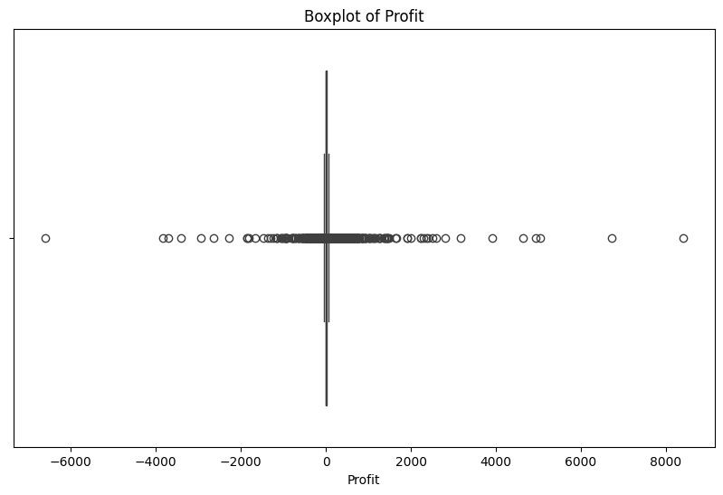
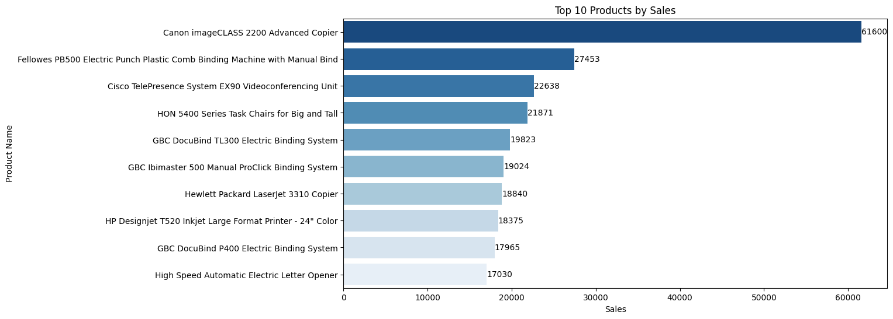
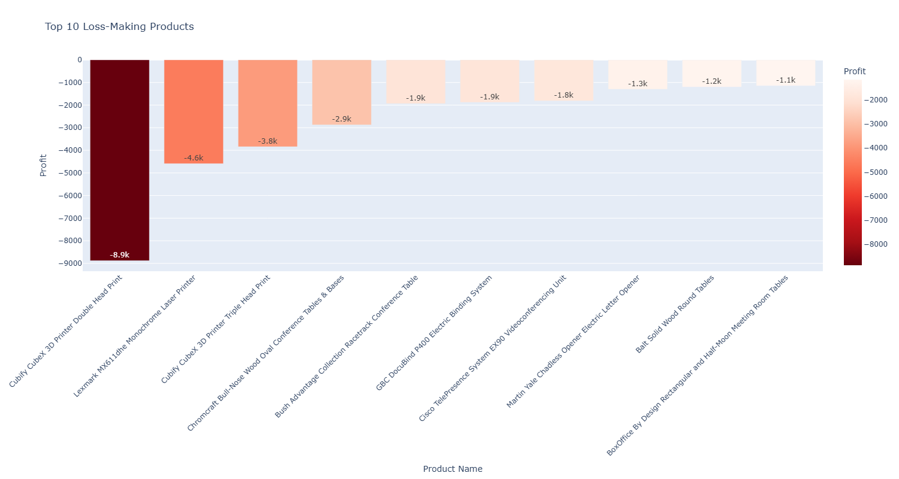
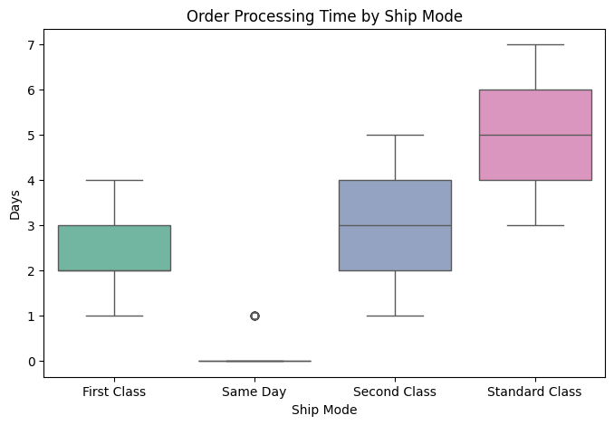

# Superstore Data Analysis using Python

## Project Overview
This project analyzes Superstore sales data using Python to uncover patterns, trends, and insights that can help businesses make informed decisions. The analysis includes data exploration, cleaning, feature engineering, and visualization.

## Project Steps

### 1. Data Loading & Understanding
- Loaded the Superstore CSV file in Jupyter Lab / Google Colab.  
- Explored the dataset using:
  - `head()`, `tail()`, `sample()`  
  - `info()` to understand data types and structure  
  - Checked for null/missing values  

### 2. Data Cleaning & Outlier Detection
- Verified and corrected datatypes for each column.  
- Checked for outliers using:
  - **Interquartile Range (IQR)**  
  - **Boxplots**
  - Outliers png
  -  

### 3. Feature Engineering
Created new columns to enhance analysis:

```python
df['Order_Year'] = df['Order Date'].dt.year
df['Order_Month'] = df['Order Date'].dt.month
df['Profit_Margin'] = df['Profit'] / df['Sales']
df['Revenue_per_Quantity'] = df['Sales'] / df['Quantity']
df['Order_Processing_Time'] = (df['Ship Date'] - df['Order Date']).dt.days

cat_cols = ['Segment', 'Category', 'Region', 'Ship Mode']
for col in cat_cols:
    df[col] = df[col].astype('category')

df['Discount_Percentage'] = df['Discount'] * 100

### 4. Data Visualization
Used **Seaborn**, **Matplotlib**, and **Plotly Express** for visualizations.  

Key visualizations include:  
- **Sales trends over time**  
- **Profit and revenue analysis**  
- **Category, segment, and regional performance**  
- **Discount and shipping mode analysis**



